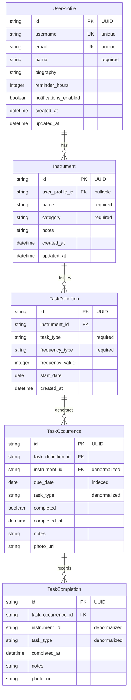
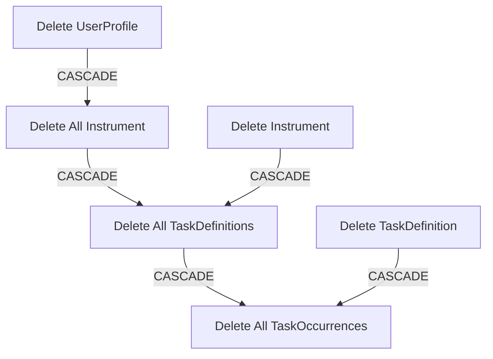
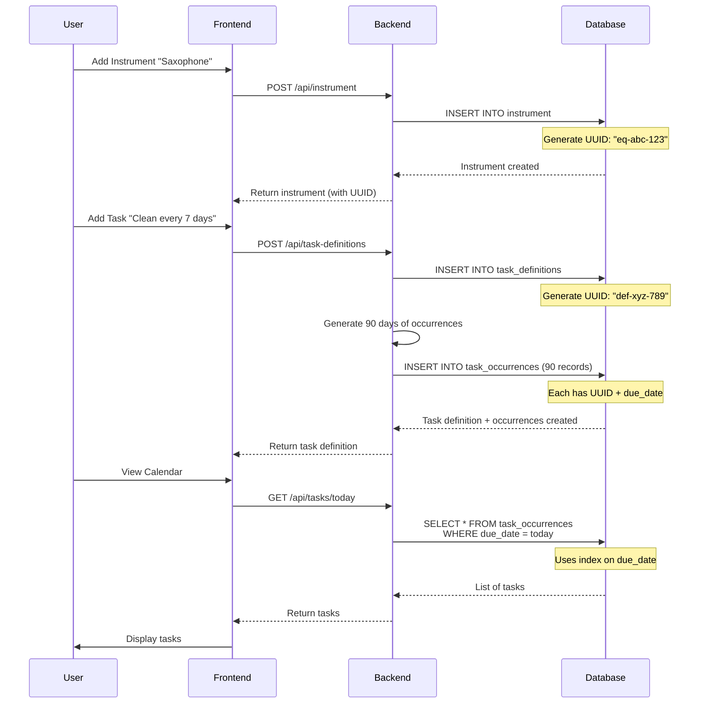

# Database Operation Explanation

## Overview

The database uses **SQLite** with **UUID primary keys** throughout. This design enables offline-first operation where devices can create records without network connectivity, then sync later without ID collisions.

## Database Location

- **File**: `backend/practice_tracker.db`
- **Created**: Automatically when backend starts (`main.py` runs `init_db()`)
- **Engine**: SQLAlchemy ORM with SQLite backend

## Database Structure

The database has 5 main tables organized in a hierarchical relationship:

```
UserProfile (Root)
    ↓ (1:many)
Instrument
    ↓ (1:many)
TaskDefinition
    ↓ (1:many)
TaskOccurrence
    ↓ (1:many)
TaskCompletion
```

### Entity Relationship Diagram



## Tables Explained

### 1. user_profile (Root Table)

**Purpose**: Main entry point - represents the user account.

**Primary Key**: `id` (UUID string)
- Generated using `uuid.uuid4()` when record is created
- Example: `"550e8400-e29b-41d4-a716-446655440000"`

**Key Fields**:
- `username` - Unique, nullable (for future login)
- `email` - Unique, nullable (for future login)
- `name` - Required (display name)
- `reminder_hours` - Default 24 (hours before task due for reminder)
- `notifications_enabled` - Boolean flag

**Relationships**:
- **Has many**: Instrument (cascade delete)
- When user is deleted → all instrument is automatically deleted

**Operation**:
- Created automatically on backend startup if none exists
- Only one profile per database (currently)
- Future: Can support multiple users with authentication

---

### 2. instrument

**Purpose**: Represents musical instruments or instrument items owned by a user.

**Primary Key**: `id` (UUID string)

**Foreign Keys**:
- `user_profile_id` → `user_profile.id` (nullable)
  - Links instrument to user
  - Nullable allows instrument without a user (for backwards compatibility)

**Key Fields**:
- `name` - Required (e.g., "Saxophone", "Trumpet")
- `category` - Required enum (Woodwind, Brass, Percussion, etc.)
- `notes` - Optional text field

**Relationships**:
- **Belongs to**: UserProfile (many-to-one)
- **Has many**: TaskDefinition (cascade delete)
- **Has many**: TaskOccurrence (denormalized reference)

**Cascade Behavior**:
- Deleting user → deletes all instrument
- Deleting instrument → deletes all task definitions

---

### 3. task_definitions

**Purpose**: Template/schedule for recurring maintenance tasks on instrument.

**Primary Key**: `id` (UUID string)

**Foreign Keys**:
- `instrument_id` → `instrument.id` (required)

**Key Fields**:
- `task_type` - Enum: "Cleaning", "Drying", "Disinfecting", "Other"
- `frequency_type` - Enum: "days", "weekly", "monthly"
- `frequency_value` - Integer:
  - If `frequency_type = "days"`: N days (e.g., 7 = every 7 days)
  - If `frequency_type = "weekly"`: Always 1 (every week)
  - If `frequency_type = "monthly"`: Always 1 (every month)
- `start_date` - Date when schedule begins

**Relationships**:
- **Belongs to**: Instrument (many-to-one)
- **Generates**: TaskOccurrence (cascade delete)

**Operation Example**:
```python
# Create task definition: "Clean saxophone every 7 days starting Jan 1"
TaskDefinition(
    instrument_id="instrument-uuid",
    task_type="Cleaning",
    frequency_type="days",
    frequency_value=7,
    start_date=date(2025, 1, 1)
)
# Backend generates TaskOccurrence records for each scheduled date
```

**Cascade Behavior**:
- Deleting instrument → deletes all task definitions
- Deleting task definition → deletes all generated task occurrences

---

### 4. task_occurrences

**Purpose**: Individual scheduled task instances generated from task definitions.

**Primary Key**: `id` (UUID string)

**Foreign Keys**:
- `task_definition_id` → `task_definitions.id` (required)
- `instrument_id` → `instrument.id` (required, **denormalized**)

**Key Fields**:
- `due_date` - **Indexed** for fast date range queries
- `task_type` - **Denormalized** from TaskDefinition (for query performance)
- `completed` - Boolean flag
- `completed_at` - Timestamp when completed
- `notes` - User notes when completing
- `photo_url` - Link to completion photo

**Denormalization Explained**:

Why duplicate `instrument_id` and `task_type` here?

1. **Performance**: Queries like "get all tasks for instrument X" don't need JOIN
2. **Independence**: Task occurrence can be queried without joining to task_definition
3. **Audit Trail**: If task_definition changes, historical occurrences keep original values

**Relationships**:
- **Belongs to**: TaskDefinition (many-to-one)
- **Belongs to**: Instrument (many-to-one, denormalized)
- **Has many**: TaskCompletion (historical records)

**Operation Flow**:
```python
# When task definition is created:
TaskDefinition(id="def-123", instrument_id="eq-456", task_type="Cleaning", ...)
    ↓
# Backend generates occurrences:
TaskOccurrence(id="occ-001", task_definition_id="def-123", instrument_id="eq-456", 
               due_date="2025-01-01", task_type="Cleaning")
TaskOccurrence(id="occ-002", task_definition_id="def-123", instrument_id="eq-456",
               due_date="2025-01-08", task_type="Cleaning")
# ... and so on for 90 days ahead
```

**Indexes**:
- `due_date` - Indexed for queries like "tasks due today", "overdue tasks"

---

### 5. task_completions

**Purpose**: Historical audit trail of completed tasks (separate from occurrence status).

**Primary Key**: `id` (UUID string)

**Foreign Keys**:
- `task_occurrence_id` → `task_occurrences.id` (required)

**Denormalized Fields**:
- `instrument_id` - UUID (not a foreign key, just for queries)
- `task_type` - String (preserves task type at completion time)

**Key Fields**:
- `completed_at` - Timestamp (defaults to now)
- `notes` - Completion notes
- `photo_url` - Photo URL

**Why Separate Table?**

1. **History**: Multiple completions for same occurrence (if user completes multiple times)
2. **Audit Trail**: Preserves completion details even if occurrence is modified
3. **Analytics**: Query completion history without affecting active tasks

**Operation**:
```python
# User completes a task:
TaskOccurrence.completed = True
TaskOccurrence.completed_at = now()
TaskOccurrence.notes = "Cleaned thoroughly"

# Create completion record:
TaskCompletion(
    task_occurrence_id="occ-001",
    instrument_id="eq-456",  # denormalized
    task_type="Cleaning",    # denormalized
    completed_at=now(),
    notes="Cleaned thoroughly",
    photo_url="/photos/clean-001.jpg"
)
```

---

## UUID Primary Keys Explained

### Why UUIDs Instead of Auto-Incrementing Integers?

**Traditional Approach** (Auto-increment):
```sql
id INTEGER PRIMARY KEY AUTOINCREMENT  -- 1, 2, 3, 4...
```

**UUID Approach**:
```sql
id TEXT PRIMARY KEY  -- "550e8400-e29b-41d4-a716-446655440000"
```

### Benefits for Offline Sync:

1. **No ID Collisions**:
   - Device A creates record offline → ID: `abc-123`
   - Device B creates record offline → ID: `def-456`
   - Both sync to server → No conflicts!

2. **Client-Side Generation**:
   ```javascript
   // Frontend can create ID before API call
   const instrument = {
       id: generateUUID(),  // Client generates!
       name: "Saxophone",
       ...
   };
   fetch('/api/instrument', { method: 'POST', body: instrument });
   ```

3. **Easy Merging**:
   - Multiple devices can create records simultaneously
   - Server just inserts all UUIDs (no conflict)

4. **Future-Proof**:
   - Easy to migrate to distributed database
   - Works with microservices architecture

### UUID Generation

Generated using Python's `uuid.uuid4()`:
```python
from uuid_utils import generate_uuid

# Returns: "550e8400-e29b-41d4-a716-446655440000"
new_id = generate_uuid()
```

---

## Foreign Key Relationships

### Cascade Delete Behavior



**Cascade Rules** (from `database.py`):
- `UserProfile.instrument` → `cascade="all, delete-orphan"`
- `Instrument.task_definitions` → `cascade="all, delete-orphan"`
- `TaskDefinition.task_occurrences` → `cascade="all, delete-orphan"`

**What "delete-orphan" Means**:
- If instrument is deleted → all its task definitions are deleted
- If task definition is deleted → all its occurrences are deleted
- Ensures data consistency (no orphaned records)

---

## Database Operations

### Initialization

**On Backend Startup** (`main.py`):
```python
@app.on_event("startup")
async def startup_event():
    # Drop all tables (development only!)
    Base.metadata.drop_all(bind=engine)
    # Create all tables
    init_db()
    
    # Create default user profile if none exists
    if not db.query(DBUserProfile).first():
        create_default_profile()
```

**Note**: `drop_all()` is for development. In production, use migrations (Alembic).

### Creating Records

**Example: Add Instrument**
```python
# 1. Generate UUID
instrument_id = generate_uuid()  # "abc-123-uuid"

# 2. Create record
instrument = DBInstrument(
    id=instrument_id,
    user_profile_id=user_id,  # Foreign key
    name="Saxophone",
    category="Woodwind",
    notes="Alto sax"
)

# 3. Add to session and commit
db.add(instrument)
db.commit()
db.refresh(instrument)  # Get updated timestamps
```

### Querying Records

**Example: Get All Instrument for User**
```python
instrument = db.query(DBInstrument).filter(
    DBInstrument.user_profile_id == user_id
).all()
```

**Example: Get Tasks Due Today**
```python
today = date.today()
tasks = db.query(DBTaskOccurrence).filter(
    DBTaskOccurrence.due_date == today,
    DBTaskOccurrence.completed == False
).all()
```

**Example: Join Query**
```python
# Get instrument with its task definitions
instrument = db.query(DBInstrument).options(
    joinedload(DBInstrument.task_definitions)
).filter(
    DBInstrument.id == instrument_id
).first()
```

### Updating Records

```python
instrument = db.query(DBInstrument).filter(
    DBInstrument.id == instrument_id
).first()

instrument.name = "New Name"
instrument.updated_at = datetime.utcnow()  # Auto-updated

db.commit()
```

### Deleting Records

```python
instrument = db.query(DBInstrument).filter(
    DBInstrument.id == instrument_id
).first()

db.delete(instrument)
# Cascade delete automatically removes:
# - All task definitions
# - All task occurrences
# - All task completions

db.commit()
```

---

## Indexes and Performance

### Automatic Indexes

SQLite automatically creates indexes for:
- **Primary Keys**: All `id` columns
- **Foreign Keys**: All foreign key columns
- **Unique Constraints**: `username`, `email` in UserProfile

### Manual Indexes

- **`task_occurrences.due_date`**: Indexed for date range queries
  ```python
  due_date = Column(Date, nullable=False, index=True)
  ```

### Query Performance Tips

1. **Use indexed columns** in WHERE clauses
   ```python
   # Fast - uses index
   tasks = db.query(DBTaskOccurrence).filter(
       DBTaskOccurrence.due_date == today
   ).all()
   ```

2. **Denormalization** improves read performance
   - `TaskOccurrence.instrument_id` (denormalized) avoids JOIN
   - `TaskOccurrence.task_type` (denormalized) avoids JOIN

3. **Limit results** for large datasets
   ```python
   tasks = db.query(DBTaskOccurrence).limit(100).all()
   ```

---

## Data Flow Example

### Complete Workflow: Creating Instrument with Task Schedule



---

## Summary

**Key Design Decisions**:

1. **UUID Primary Keys**: Enable offline sync without ID collisions
2. **Cascade Deletes**: Maintain data consistency automatically
3. **Denormalization**: Improve query performance (instrument_id, task_type in TaskOccurrence)
4. **Separate Completion Table**: Preserve audit trail independently
5. **Date Indexing**: Fast queries for "tasks due today/overdue"

**Database File**:
- Location: `backend/practice_tracker.db`
- Format: SQLite (single file database)
- Size: Grows as data is added
- Backup: Simply copy the `.db` file

**Viewing the Database**:
- Web: http://localhost:8000/admin/db-viewer
- DB Browser: Open `backend/practice_tracker.db`
- Command Line: `sqlite3 backend/practice_tracker.db`

