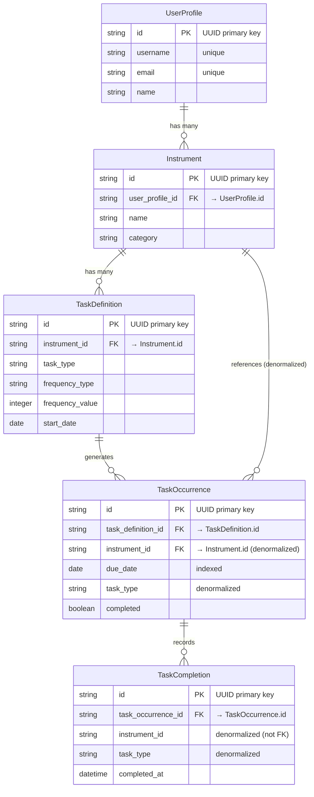
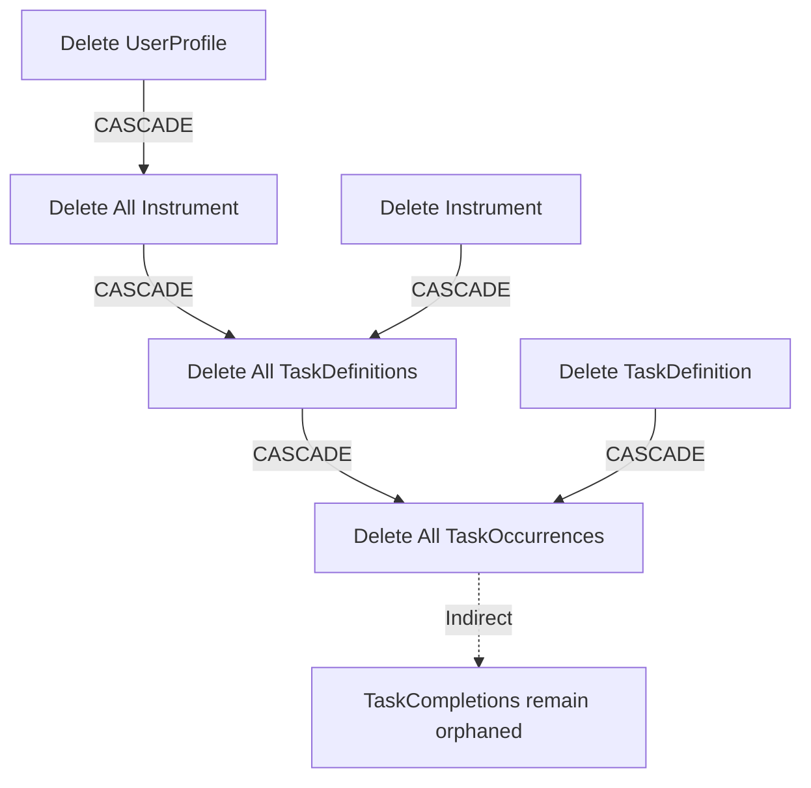

# Database Relationships and Keys Explained

## Overview

The database uses a **hierarchical relationship structure** where each table connects to the next level down. All relationships use **UUID primary keys** and **UUID foreign keys** for offline-sync capability.

## Relationship Structure

```
UserProfile (Root)
    │
    ├──→ Instrument (many instrument items per user)
    │       │
    │       ├──→ TaskDefinition (many task schedules per instrument)
    │       │       │
    │       │       └──→ TaskOccurrence (many task instances per schedule)
    │       │               │
    │       │               └──→ TaskCompletion (completion records)
    │       │
    │       └──→ TaskOccurrence (also directly linked - denormalized)
```

## Visual Relationship Diagram



## Primary Keys (PK)

**All tables use UUID strings as primary keys:**

| Table | Primary Key | Example |
|-------|-------------|---------|
| UserProfile | `id` (UUID) | `"550e8400-e29b-41d4-a716-446655440000"` |
| Instrument | `id` (UUID) | `"abc-123-uuid-here"` |
| TaskDefinition | `id` (UUID) | `"def-456-uuid-here"` |
| TaskOccurrence | `id` (UUID) | `"ghi-789-uuid-here"` |
| TaskCompletion | `id` (UUID) | `"jkl-012-uuid-here"` |

**Why UUIDs?**
- Globally unique (no collisions across devices)
- Can be generated client-side (offline capability)
- Easy to sync between multiple devices/servers

## Foreign Keys (FK)

**Foreign keys link tables together using UUID references:**

### 1. Instrument → UserProfile

```python
# Instrument table
user_profile_id = Column(String, ForeignKey("UserProfile.id"), nullable=True)
```

**Relationship**: Many Instrument → One UserProfile
- One user can have many instrument items
- Instrument belongs to one user (or none if `nullable=True`)

**Example**:
```
UserProfile.id = "user-123"
Instrument 1: { id: "eq-001", user_profile_id: "user-123" }
Instrument 2: { id: "eq-002", user_profile_id: "user-123" }
Instrument 3: { id: "eq-003", user_profile_id: "user-123" }
```

### 2. TaskDefinition → Instrument

```python
# TaskDefinition table
instrument_id = Column(String, ForeignKey("Instrument.id"), nullable=False)
```

**Relationship**: Many TaskDefinitions → One Instrument
- One instrument can have many task schedules
- TaskDefinition belongs to exactly one instrument

**Example**:
```
Instrument.id = "eq-001"
TaskDefinition 1: { id: "def-001", instrument_id: "eq-001", task_type: "Cleaning" }
TaskDefinition 2: { id: "def-002", instrument_id: "eq-001", task_type: "Drying" }
TaskDefinition 3: { id: "def-003", instrument_id: "eq-001", task_type: "Disinfecting" }
```

### 3. TaskOccurrence → TaskDefinition

```python
# TaskOccurrence table
task_definition_id = Column(String, ForeignKey("TaskDefinitions.id"), nullable=False)
```

**Relationship**: Many TaskOccurrences → One TaskDefinition
- One task definition generates many task occurrences (one per scheduled date)
- TaskOccurrence belongs to exactly one TaskDefinition

**Example**:
```
TaskDefinition.id = "def-001" (Clean every 7 days)
TaskOccurrence 1: { id: "occ-001", task_definition_id: "def-001", due_date: "2025-01-01" }
TaskOccurrence 2: { id: "occ-002", task_definition_id: "def-001", due_date: "2025-01-08" }
TaskOccurrence 3: { id: "occ-003", task_definition_id: "def-001", due_date: "2025-01-15" }
```

### 4. TaskOccurrence → Instrument (Denormalized)

```python
# TaskOccurrence table
instrument_id = Column(String, ForeignKey("Instrument.id"), nullable=False)  # Denormalized
```

**Relationship**: Many TaskOccurrences → One Instrument (denormalized)
- This is a **duplicate** relationship for performance
- TaskOccurrence already links to Instrument via TaskDefinition, but we also store it directly

**Why Denormalized?**
- Faster queries: "Get all tasks for instrument X" doesn't need JOIN
- TaskOccurrence can be queried independently

### 5. TaskCompletion → TaskOccurrence

```python
# TaskCompletion table
task_occurrence_id = Column(String, ForeignKey("TaskOccurrences.id"), nullable=False)
```

**Relationship**: Many TaskCompletions → One TaskOccurrence
- One task occurrence can have multiple completion records (history/audit trail)
- TaskCompletion belongs to exactly one TaskOccurrence

**Example**:
```
TaskOccurrence.id = "occ-001"
TaskCompletion 1: { id: "comp-001", task_occurrence_id: "occ-001", completed_at: "2025-01-01 10:00" }
TaskCompletion 2: { id: "comp-002", task_occurrence_id: "occ-001", completed_at: "2025-01-01 15:00" } (re-completed)
```

## Cascade Delete Behavior

When a parent record is deleted, child records are automatically deleted:



**Cascade Rules** (from SQLAlchemy):

1. **UserProfile → Instrument**
   ```python
   instrument = relationship("Instrument", cascade="all, delete-orphan")
   ```
   - Delete UserProfile → All Instrument deleted

2. **Instrument → TaskDefinition**
   ```python
   task_definitions = relationship("TaskDefinition", cascade="all, delete-orphan")
   ```
   - Delete Instrument → All TaskDefinitions deleted

3. **TaskDefinition → TaskOccurrence**
   ```python
   task_occurrences = relationship("TaskOccurrence", cascade="all, delete-orphan")
   ```
   - Delete TaskDefinition → All TaskOccurrences deleted

**Note**: TaskCompletion does NOT cascade - completion records are preserved even if TaskOccurrence is deleted (for audit purposes).

## Complete Example Data Flow

### Creating a Task Schedule:

```python
# 1. User exists
user = UserProfile(id="user-123", name="John")

# 2. User adds instrument
instrument = Instrument(
    id="eq-001",
    user_profile_id="user-123",  # FK → UserProfile
    name="Saxophone",
    category="Woodwind"
)

# 3. User creates task definition (schedule)
task_def = TaskDefinition(
    id="def-001",
    instrument_id="eq-001",  # FK → Instrument
    task_type="Cleaning",
    frequency_type="days",
    frequency_value=7,
    start_date="2025-01-01"
)

# 4. Backend generates task occurrences
occurrence1 = TaskOccurrence(
    id="occ-001",
    task_definition_id="def-001",  # FK → TaskDefinition
    instrument_id="eq-001",          # FK → Instrument (denormalized)
    due_date="2025-01-01",
    task_type="Cleaning"            # Denormalized
)

occurrence2 = TaskOccurrence(
    id="occ-002",
    task_definition_id="def-001",  # FK → TaskDefinition
    instrument_id="eq-001",          # FK → Instrument (denormalized)
    due_date="2025-01-08",
    task_type="Cleaning"            # Denormalized
)

# 5. User completes task
completion = TaskCompletion(
    id="comp-001",
    task_occurrence_id="occ-001",  # FK → TaskOccurrence
    instrument_id="eq-001",          # Denormalized (not FK)
    task_type="Cleaning",           # Denormalized
    completed_at="2025-01-01 10:00"
)
```

## Querying with Relationships

### Get all instrument for a user:
```python
instrument = db.query(Instrument).filter(
    Instrument.user_profile_id == user_id
).all()
```

### Get all task definitions for instrument:
```python
task_defs = db.query(TaskDefinition).filter(
    TaskDefinition.instrument_id == instrument_id
).all()
```

### Get all task occurrences for a task definition:
```python
occurrences = db.query(TaskOccurrence).filter(
    TaskOccurrence.task_definition_id == task_def_id
).all()
```

### Join query (instrument with its task definitions):
```python
from sqlalchemy.orm import joinedload

instrument = db.query(Instrument).options(
    joinedload(Instrument.task_definitions)
).filter(
    Instrument.id == instrument_id
).first()

# Now access: instrument.task_definitions (list of TaskDefinition objects)
```

### Get all tasks for instrument (using denormalized FK):
```python
# Fast query - uses denormalized instrument_id (no JOIN needed)
tasks = db.query(TaskOccurrence).filter(
    TaskOccurrence.instrument_id == instrument_id,
    TaskOccurrence.completed == False
).all()
```

## Summary Table

| Relationship | Parent → Child | Foreign Key Column | Type | Cascade Delete |
|--------------|----------------|-------------------|------|----------------|
| UserProfile → Instrument | 1:many | `Instrument.user_profile_id` | FK | ✅ Yes |
| Instrument → TaskDefinition | 1:many | `TaskDefinition.instrument_id` | FK | ✅ Yes |
| TaskDefinition → TaskOccurrence | 1:many | `TaskOccurrence.task_definition_id` | FK | ✅ Yes |
| Instrument → TaskOccurrence | 1:many | `TaskOccurrence.instrument_id` | FK (denormalized) | ❌ No (via TaskDefinition) |
| TaskOccurrence → TaskCompletion | 1:many | `TaskCompletion.task_occurrence_id` | FK | ❌ No (preserve history) |

## Key Points

1. **All primary keys are UUIDs** - Enable offline sync
2. **Foreign keys reference parent UUIDs** - Maintain relationships
3. **Cascade deletes** - Maintain data consistency automatically
4. **Denormalization** - Performance optimization (instrument_id, task_type in TaskOccurrence)
5. **History preservation** - TaskCompletion doesn't cascade (audit trail)

